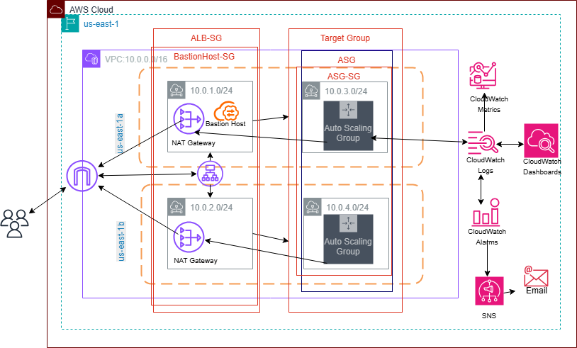

# CloudWatch Monitoring & Auto Scaling Project

This project demonstrates a scalable, production-grade AWS architecture that automatically scales EC2 instances based on CloudWatch Metrics while maintaining high availability. This system integrates:
- **CloudWatch monitoring**
- **Auto Scaling**
- **SNS notifications**

It simulates real-world infrastructure observability, using EC2, ALB, and CloudWatch to monitor performance and respond to load changes automatically. This project emphasizes AWS best practices for high availability and security.

## Table of Contents
- [Project Purpose](#project-purpose)
- [Architecture Overview](#architecture-overview)
- [Features](#features)
- [Prerequisites](#prerequisites)
- [Infrastructure Setup](#infrastructure-setup)
- [Deployment Steps](#deployment-steps)
- [Usage](#usage)
- [Key Skills](#key-skills)
- [Licence](#license)

## Project Purpose
This project demonstrates how to build a resilient, scalable, and observable cloud architecture on AWS. We will be using EC2, ALB, AutoScaling, CloudWatch, SNS, and NAT Gateway This architecture will ensure application resilience under varying traffic loads by simulating real-world traffic. This project will also highlight operational readiness through monitoring and automated response. 

## Architecture Overview
The system is designed to be highly available and scalable across multiple Availablility Zones:

- **Virtual Private Cloud (VPC)**:  Configured with 10.0.0.0/16 CIDR. This will feature 4 subnets (2 public, 2 private) across 2 AZs
- **Application Load Balancer (ALB)**: Deployed in public subnets (one in each AZ) to distribute incoming HTTP trafic.
- **Auto Scaling Group (ASG)**: Manages EC2 instances in private subnets to provision or de-provision instances automatically.
- **NAT Gateway**: Installed in public subnets to allow private instances to reach the internet for updates and communication with AWS services.
- **Launch Template**: Provide configuration for instances with user data to  install Apache & CloudWatch Agent, and display metadata for instances (AZ, IP, etc)
- **CloudWatch**: Centralization for custom metrics, dashboards, alarms for performance thresholds, and aggregated logs.
- **SNS Topic**: Used to send email notifications to subscribers for critical alarms.
- **IAM Roles**: Designed with least privilege principles to the necessary permissions to AWS resources.
- **Security Group**: Configured for Bastion Host, ALB and ASG to control network trafic flow.

## Features
- **Multi-AZ High Availability**: Deploys across two Availability Zones for fault tolerance
- **Custom Metric Collection**: CloudWatch Agent deployed on Ec2 instances for custom metric meric collection (e.g., memory usage and disk usage)
- **Centralized Logging**: Application and system logs are pushed to CloudWatch Logs for centralized monitoring and analysis.
- **Automated Scaling**: CloudWatch Alarms for high/low CPU utilization will trigger Auto Scaling policies to automatically adjust instance counts.
- **High Availability**: Infrastructure distributed across Availability Zones to ensure resilience
- **Instance Metadata Display**: EC2 instances will display metadata. This will verify load balancer effictiveness and multi-AZ.

## Prerequisites
- An active AWS account
- IAM permissions to create VPC, EC2, ALB, IAM Roles, SNS
- Basic understanding of AWS services

## Infrastructure Setup

1. **VPC & Networking**
    - 1 VPC: `10.0.0.0/16`
    - 2 Public Subnets (for ALB and NAT Gateways)
    - 2 Private Subnets (for EC2 instances)
    - Internet Gateway with public route tables
    - Route Tables: Public route tables direct internet-bound traffic via the Internet Gateway; private route tables direct via the NAT Gateway.
    - NAT Gateway with private route tables

2. **Subnets**
    - **Public Subnets (2)**: One in each AZ for the Application Load Balancer (ALB), Bastion Host and NAT Gateway:
        - Public Subnet 1: CIDR 10.0.1.0/24
        - Public Subnet 2: CIDR 10.0.2.0/24 
    
    - Private Subnets (2) (One in each AZ for the EC2 Instances):
        - Private Subnet 1: CIDR 10.0.3.0/24
        - Private Subnet 2: CIDR 10.0.4.0/24

3. **Security Groups**
    - **ALB Security Group (ALB SG)**: Allows HTTP traffic (port 80) from anywhere (0.0.0.0/0).
    - **Bastion Host Security Group (Bastion SG)**: 
        - Allows inbound SSH (port 22) from MyIP address. 
        - Allows outbound traffic to EC2 Instances Security Group.

    - **EC2 Instances Security Group (EC2 SG)**:
        - Allows inbound HTTP traffic (port 80) from ALB's security group.
        - Allows inbound SSH traffic (port 80) from Bastion Host's security group.
        - Allows outbound traffic to anywhere

4. **Bastion Host**
    - Bastion Host will be installed in one of the public subnets
    - Bastion Host will have its own security group
    - Will have its own IAM role

5. **IAM Roles**
    - EC2BastionRole - attach to the launch template for Bastion Host. The following permission will be attached:
        - _AmazonSSMManagedInstanceCore_
        - _CloudWatchAgentServerPolicy_
        
    - EC2APPInstanceRole- attached to the launch template for EC2 instances. The following permissions will be attached:
        - _CloudWatchAgentServerPolicy_
        - _AmazonSSMManagedInstanceCore_

4. **Launch Template**
    - Preconfigured to install Apache & CloudWatch Agent 
    - Instance metadata that displays Availability Zone

5. **Load Balancer**
    - Internet-facing ALB distributes HTTP traffic across EC2 instances in private subnets.
    - Health checks configured on HTTP endpoint (e.g., `/`).

6. **Auto Scaling Group**
    - Automatically adjusts the number of EC2 instances based on CPU utilization
    - Desired Capacity 2
    - Min: 2, Max: 4 instances
    - Scaling policy triggered by CloudWatch alarms

7. **CloudWatch Configuration**
    - Agent config: `/opt/aws/amazon-cloudwatch-agent`
    - Custom metrics: memory, disk usage
    - Logs pushed to centralized group
    - Alarms trigger scaling actions and notifications

8. **SNS Integration**
    - Topic: `cloudwatch-alerts-topic`
    - Email subscription enabled
    - Alert triggered by CPU > 70% to scale out
    - Alert triggered by CPU < 30% to scale in

## Usage
    - After deployment, the public ALB DNS will be accessed to verify that the application is live. 
    - Simulate high CPU load. 
    - CloudWatch will trigger alarms, causing the Auto Scaling Group to scale out, and notifications will be sent via SNS.

## Deployment Steps:

**Step 1: Clone Repository **
    - Clone Repository
        
**Step 2: Deploy Infrastructure**: 
    Use AWS Console to manually create the resources.

**Step 3: Subscribe to SNS Alerts**: 
    - Go to Amazon SNS
    - Find cloudwatch-alerts-topic
    - Add your email address and confirm the subscription

## CloudFormation

    - To quickly deploy this infrastructure, click below to access the CloudFormation template.
    - 

## Testing & Monitoring
Application Validation
    - Access ALB DNS from browser (e.g., http://<ALB-DNS-Name>) to confirm instance is reachable.
    - Refresh to verify AZ metadata changes between instances.

**Step 1: Load Testing**:    
    - SSH into a Bastion Host and run:

        _stress-ng --cpu 2 --timeout 300s_

**Step 2: Monitor CloudWatch**:
    - Watch CloudWatch Metrics and Alarms trigger ASG scale-out.

**Step 3: Check Email For SNS Alert**:
    - Receive SNS email alert.

## Key Skills Demonstrated
    - Designing scalable AWS infrastructure
    - Implementing high availability across AZs
    - Secure network architecture (NAT, Bastion, SGs)
    - Using CloudWatch for observability and automated scaling
    - Writing least-privilege IAM policies
    - Creating event-driven notifications via SNS
    - Using AWS's CloudFormation Template to deploy architecture

## License
    MIT License. See LICENSE file for details.